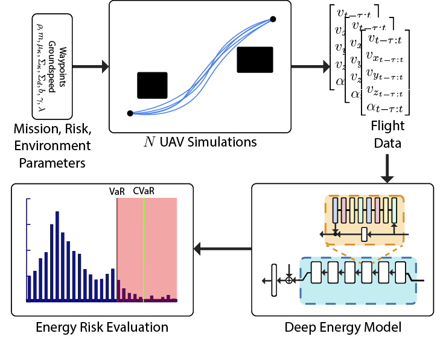
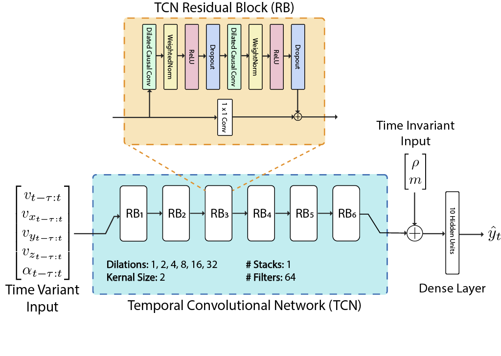

# CVaR-based Flight Energy Risk Assessment for Multirotor UAVs using a Deep Energy Model
This repository contains the code for [ICRA 2021](https://www.ieee-icra.org/) paper:

**<a href="#">CVaR-based Flight Energy Risk Assessment for Multirotor UAVs using a Deep Energy Model</a>**  
*<a href="https://arnav1.github.io">Arnav Choudhry\*</a>,
<a href="https://bradymoon.com">Brady Moon\*</a>,
<a href="https://jaypatrikar.me">Jay Patrikar\*</a>,
<a href="https://www.costasamaras.com">Constantine Samaras</a>,
<a href="https://www.ri.cmu.edu/ri-faculty/sebastian-scherer/">Sebastian Scherer</a><br/>
(\* equal contribution)*

## Brief overview <a href="https://youtu.be/PHXGigqilOA">[Video]</a>


 
Energy management is a critical aspect of risk assessment for Uncrewed Aerial Vehicle (UAV) flights, as a depleted battery during a flight brings almost guaranteed vehicle damage and a high risk of human injuries or property damage. Predicting the amount of energy a flight will consume is challenging as routing, weather, obstacles, and other factors affect the overall consumption. 



We develop a deep energy model for a UAV that uses Temporal Convolutional Networks to capture the time varying features while incorporating static contextual information. Our energy model is trained on a real world dataset and does not require segregating flights into regimes. We illustrate an improvement in power predictions by 29% on test flights when compared to a state-of-the-art analytical method. Using the energy model, we can predict the energy usage for a given trajectory and evaluate the risk of running out of battery during flight. We propose using Conditional Value-at-Risk (CVaR) as a metric for quantifying this risk. We show that CVaR captures the risk associated with worst-case energy consumption on a nominal path by transforming the output distribution of Monte Carlo forward simulations into a risk space. Computing the CVaR on the risk-space distribution provides a metric that can evaluate the overall risk of a flight before take-off. Our energy model and risk evaluation method can improve flight safety and evaluate the coverage area from a proposed takeoff location.

## Prerequisites

* Python >= 3.8

### Installation

* Clone this repo:
```
git clone #
cd #
```

* Create a new virtual environment using Conda or virtualenv. 
```
conda create --name <envname> python=3.8
```

* Activate the environment and install the requirements:
```
conda activate <envname>
pip install -r requirements.txt
```

## Datasets
We use the data set provided in the paper *"Data Collected with Package Delivery Quadcopter Drone"* (available <a href="Data Collected with Package Delivery Quadcopter Drone">here</a>). The scripts are to preprocess the dataset are included.

## Training
We provide a training script to train a TCN or LSTM model with some amount of flexibility. To train a custom recurrent net, run the following line of code along with some (or none) of the options provided
```
python train.py
```
Optional arguments can be given as following:

- `-d`, `--directory` sets the working directory for data. Default is current working directory. 
- `-o`, `--output` sets the output directory for training. Default is current working directory. 
- `-D`, `--data` whether to download the data or not. This is a binary flag whose default is set to `False`.
- `--lookback` sets the size of lookback window. (default = `20`)
- `--batch_size` size of batch passed to `tf`. (default = `32`)
- `--nb_filters` (For TCN) The number of filters to use in the convolutional layers. Would be similar to units for LSTM. Can be a list. (default = `32`)
- `--kernel_size` (For TCN) The size of the kernel to use in each convolutional layer. (default = `3`)
- `--nb_stacks` (For TCN) The number of stacks of residual blocks to use. (default = `1`)
- `--n_layers` Number of layers in the network. (default = `4`)
- `--total_epochs` Total number passes over the entire training data set. (default = `10`)
- `--optimizer` Optimizer used by the neural network. (default = `Adam`)
- `--dropout` Dropout used by the neural network. (default = `0`)
- `--units` (For LSTM) The number of units in each layer. (default = `32`)
- `--net_type` The type of net to train. Either `lstm ` or `tcn`. (default = `tcn`)
- `--stateful` sets whether to create a stateful neural net or not. This is a binary flag whose default is set to `False`.

On running the training script, everything is saved in a new folder called `Results` which is created in the output directory. The initialized model is saved in a sub-folder called `saved_models`.  It is saved with the name `<save_str>` which is created using the following rule for a TCN
```
{net_type}_{lookback}_{nb_filters}_{kernel_size}_{nb_stacks}_{n_layers}
```
and the following rule for an LSTM
```
{net_type}_{lookback}_{dropout}_{units}_{n_hidden}_{optimizer}
```
The model is checkpointed at epoch `0` as well as every `50` training flights. The checkpoints are stored in a sub-folder called `ckpts/<save str>`. While training, logs are saved for tensorboard in the sub-folder `logs/<save str>/<time at start of experiment>`. At the end of the experiment, a `csv` file is created with the Validation and Training results at `CsvResults/<save str>/csv_result.csv`.


## Evaluation
The repo contains the deep energy model and the Liu model cited as the baseline in the paper. To run the evaluation script on the provided checkpoints, run the following
```
python evaluation.py
```
Optional arguments can be given as following:

- `-d`, `--directory` sets the working directory for the data. Default is current working directory. 
- `-m`, `--model` model(s) to evaluate. Can be any of `b-TCN`, `s-TCN`, `b-LSTM`, `s-LSTM`, `liu`, `all` or `custom`. Default is `b-TCN`.
- `-e`, `--evaluate` which dataset to evaluate on. Can be `train`, `test`, `val`, `random`, or `all`. Defult is `test`.
- `-D`, `--data` whether to download the dataset or not. This is a binary flag whose default is set to `False`.
- `-c`, `--ckpt` is the location of the checkpoint file for weights of the custom neural net. It is __required__ if a custom model is selected.
- Other additional options are available in case a `custom` net is to be evaluated. For details on those options please check the *Train* section above.

## Pre-trained models
We also ship the checkpoints to reproduce the results presented in the paper. Details on how to run the model with the pretrained checkpoints are shown in the *Evaluation* section of this README file.

<table>
    <thead>
        <tr>
            <th rowspan="2" align="center">Model</th>
            <th colspan="2" align="center">Random Flights</th>
            <th colspan="2" align="center">Test Flights</th>
            <th rowspan="2" align="center"># params</th>
        </tr>
        <tr>
            <th align="center">MAPE (%)</th>
            <th align="center">RE (%)</th>
            <th align="center">MAPE (%)</th>
            <th align="center">RE (%)</th>
        </tr>
    </thead>
    <tbody>
        <tr>
            <td>Liu model</td>
            <td align="center">14.05</td>
            <td align="center">9.16</td>
            <td align="center">12.70</td>
            <td align="center">7.41</td>
            <td align="right">5</td>
        </tr>
        <tr>
            <td>b-LSTM</td>
            <td align="center">13.58</td>
            <td align="center">10.35</td>
            <td align="center">11.47</td>
            <td align="center">7.57</td>
            <td align="right">84,649</td>
        </tr>
        <tr>
            <td>s-LSTM</td>
            <td align="center">15.35</td>
            <td align="center">11.65</td>
            <td align="center">12.36</td>
            <td align="center">8.24</td>
            <td align="right">5,833</td>
        </tr>
        <tr>
            <td>b-TCN</td>
            <td align="center">10.38</td>
            <td align="center">7.38</td>
            <td align="center">9.06</td>
            <td align="center">5.12</td>
            <td align="right">76,073</td>
        </tr>
        <tr>
            <td>s-TCN</td>
            <td align="center">10.36</td>
            <td align="center">7.56</td>
            <td align="center">9.13</td>
            <td align="center">5.52</td>
            <td align="right">5,225</td>
        </tr>
    </tbody>
</table>

For more information on the models please refer to the paper.

## Quadrotor Simulation
We have also provided our simple quadrotor simulation for running MC simulations over a flight path and computing the risk. 

```
python sim.py
```
The example environment is the same as Case Study 1 from our paper. The wind fiels and interfaces for getting wind at any position for any inlet condition is also included.

## Cite
If you have any questions, please contact [arnav@cmu.edu](mailto:arnav@cmu.edu) or 
[bradym@andrew.cmu.edu](mailto:bradym@andrew.cmu.edu), or open an issue on this repo. 

If you find this repository useful for your research, please cite the following paper:
```bibtex
@proceedings{cvarEnergy,
    title={CVaR-based Flight Energy Risk Assessment for Multirotor UAVs using a Deep Energy Model},
    author={Choudhry, Arnav and Moon, Brady and Patrikar, Jay and Samaras, Constantine and Scherer, Sebastian},
    booktitle = {International Conference on Robotics and Automation (ICRA)},
    year={2021}
}
```